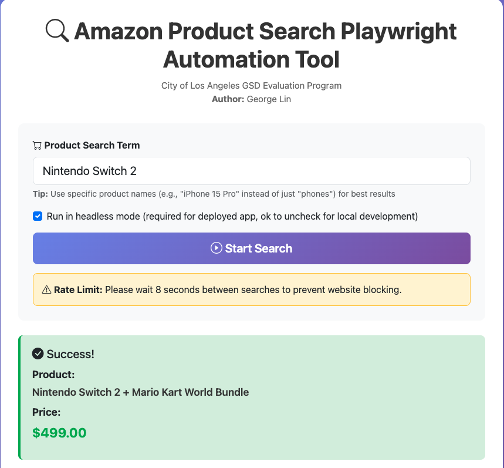

# Amazon Product Search Automation

**City of Los Angeles General Services Department - Internship Evaluation Program**
**Author:** George Lin

A Python-based web automation tool that searches Amazon products and extracts pricing information using Playwright. Includes a web interface with Bootstrap UI for remote access.

## Live Demo

🌐 **Live Application:** https://python-playwright-gl.onrender.com/


---

## Features

- ✅ **Automated Browser Control**: Uses Playwright to control Chromium browser
- ✅ **Product Search**: Searches Amazon for specified products
- ✅ **Data Extraction**: Extracts product name and price from search results
- ✅ **Web UI**: Bootstrap-styled interface with real-time logs
- ✅ **REST API**: HTTP endpoints for remote automation
- ✅ **Rate Limiting**: 15-second cooldown between requests
- ✅ **Error Handling**: Robust handling for timeouts and missing elements

---

## Local Setup

### Prerequisites
- Python 3.8 or higher
- pip (Python package manager)
- Git

### Installation

1. **Clone the repository**
   ```bash
   git clone <repository-url>
   cd python_playwright
   ```

2. **Create virtual environment** (recommended)
   ```bash
   python -m venv venv

   # Activate on macOS/Linux:
   source venv/bin/activate

   # Activate on Windows:
   venv\Scripts\activate
   ```

3. **Install dependencies**
   ```bash
   pip install -r requirements.txt
   ```

4. **Install Playwright browsers**
   ```bash
   playwright install chromium
   ```

---

## Running the Application

### Option 1: Web Interface (Recommended)

Start the Flask web server:

```bash
python app.py
```

Then open your browser to: **http://localhost:5000**

**Using the Web UI:**
1. Enter a **specific** product name (e.g., "Nintendo Switch 2 OLED", "iPhone 15 Pro Max")
   - ⚠️ **Tip:** Use specific product names, not generic categories (e.g., "iPhone 15 Pro" instead of just "phones")
2. Choose headless mode (optional for local development)
3. Click "Start Search"
4. View real-time logs and results

### Option 2: Command Line Script

Run the core automation script directly:

```bash
python script.py
```

**Example Output:**
```
Loading Amazon homepage...
Amazon homepage loaded successfully
No 'Continue shopping' button found, proceeding...
Successfully Found Product: Nintendo Switch 2 OLED Model...
Price: $499.00
```

### Option 3: Run Tests

Execute the test suite:

```bash
pytest script_test.py -v
```

---

## API Usage

### Health Check
```bash
curl http://localhost:5000/api/health
```

### Search Product
```bash
curl -X POST http://localhost:5000/api/search \
  -H "Content-Type: application/json" \
  -d '{
    "search_term": "Nintendo Switch 2",
    "headless": true
  }'
```

**Response Example:**
```json
{
  "success": true,
  "product_name": "Nintendo Switch 2 OLED Model...",
  "price": "$499.00",
  "error": null,
  "logs": [
    "[10:30:15] Starting search for: Nintendo Switch 2",
    "[10:30:16] Initializing browser...",
    "[10:30:25] Success! Found: Nintendo Switch 2 OLED Model...",
    "[10:30:25] Price: $499.00"
  ]
}
```

---

## Project Structure

```
python_playwright/
├── script.py              # Core automation script
├── script_test.py         # Pytest test suite
├── app.py                 # Flask web application
├── templates/
│   └── index.html         # HTML template
├── static/
│   ├── css/
│   │   └── style.css      # Styles
│   └── js/
│       └── app.js         # JavaScript
├── requirements.txt       # Dependencies
├── Procfile              # Render deployment config
├── README.md
└── .gitignore
```

---

## Technologies Used

- **Python 3.8+** - Core language
- **Playwright** - Browser automation
- **Flask** - Web framework
- **Bootstrap 5** - Frontend UI
- **pytest** - Testing framework
- **Gunicorn** - Production server

---

## Author

**George Lin**
City of Los Angeles General Services Department

Software Engineering Internship Evaluation Program